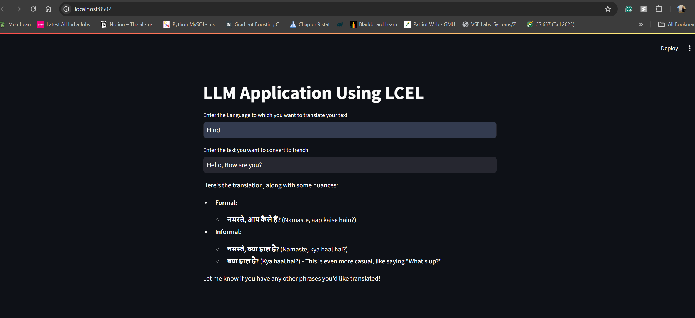

## Langchain ecosystem
This is the repo that showcases the capabilities of Langchanin community. My main goal is to explore the capabilities of Langchain ecosystem and getting hands-on experience on various functionalities.

## Tech Stack:
- Python
- LangChain
- LangSmith - for LLM tracking purpose
- Streamlit
- Groq
- LangServe --> To create Rest APIs (integrated with Fast API)


## Concepts/Frameworks explored:
- Open AI: 
    - How to invoke openAI API?
    - Simple application that reads a webpage and answers users query using OpenAI
- Ollama:
- Data Ingestion: Data loading techniques
- Data Transformer: Different data splitting techniques
- Embeddings: Different embedding techniques using OpenAI, Ollama, Huggingface
- Vector Stores: Different types of vector stores like FAISS, ChromaDB
- LCEL (Lang chain expression language): Developed a language translator using LLM
    - Used groq API (A platform that provides fast AI inference of open source models)
    - Used LangServe to create REST APIs --> check `serve.py` file for code
    - `client.py` provides streamlit interface to take inputs from user and gives response by interacts with REST API we created using Langserve and Fast API

## Applications developed:
- Chatbots
    - 1-Chatbots.ipynb: Basic chatbot with message history, trimming concepts
    - vectorretriever.ipynb: Vector Retriver concepts
    - conversationqa.ipynb: Used technique to rephrase the user query based on chat history and retrives information from document store.
- 


## Language Translator sample



## Prerequisites
- Setup Open AI account and load some money from https://platform.openai.com/
- Setup Langchain account and create API key from https://www.langchain.com/
- Setup Hugginface account and create access key from https://huggingface.co/
- Download and install Ollama from https://ollama.com/
- Setup groq API keys from https://console.groq.com/playground


### Some Commands used
- Create Python Virtual Environment
    ```sh
    python -m venv venv
    ```
- To activate Virtual Environment
    ```sh
    .\venv\Scripts\activate
    ```
- To run streamlit application
    ```sh
    streamlit run app.py --server.port 8502
    ```